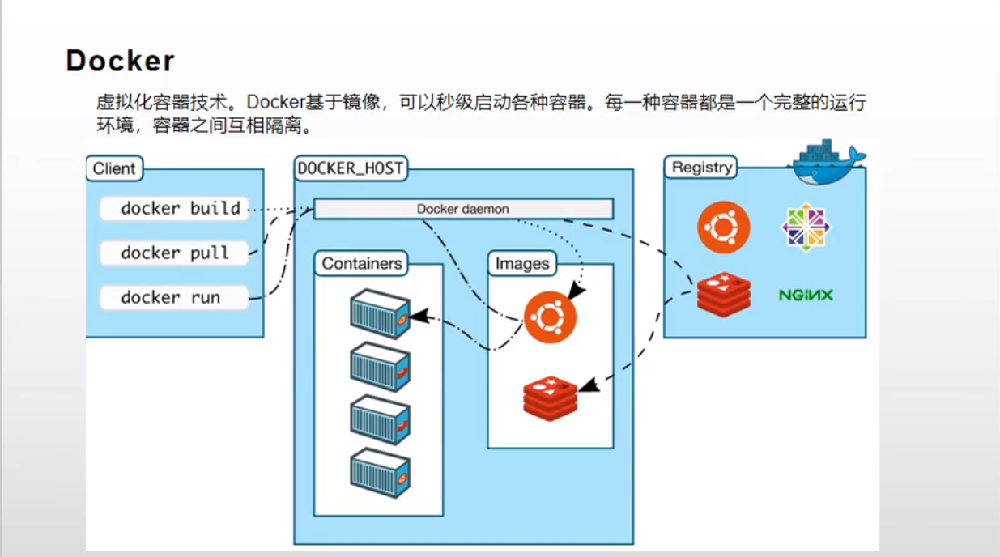

# Linux(CentOS) 上安装 docker

[toc]

## Docker

虚拟化技术容器，Docker 基于镜像，可以秒级启动各种容器。每一种容器都是一个完整的运行环境，容器之间互相隔离。



## 操作系统需求

要安装Docker Engine，你需要一个CentOS 7或8的维护版本。归档版本不受支持，也没有经过测试。

centos-extras存储库必须启用。该存储库在默认情况下是启用的，但如果已经禁用了它，则需要重新启用它。

推荐使用overlay2存储驱动程序。

## 卸载旧版本

Docker 的旧版本被称为 `docker` 或 `docker-engine`。如果已经安装了它们，请卸载它们以及相关的依赖项

```shell
sudo yum remove docker \
                  docker-client \
                  docker-client-latest \
                  docker-common \
                  docker-latest \
                  docker-latest-logrotate \
                  docker-logrotate \
                  docker-engine
```

如果yum报告没有安装这些包，也没有关系。

`/var/lib/docker/`的内容(包括图像、容器、卷和网络)会被保留。Docker引擎包现在被称为 `docker-ce`。

## 使用存储库进行安装

在新主机上第一次安装 Docker Engine 之前，需要设置 Docker 存储库。之后，你可以从存储库中安装和更新 Docker 。

**设置存储库**

安装 `yum-utils` 包(它提供 `yum-config-manager` 实用程序)并设置**稳定**存储库。

```shell
sudo yum install -y yum-utils
sudo yum-config-manager \
    --add-repo \
    https://download.docker.com/linux/centos/docker-ce.repo
```

## 安装 DOCKER 引擎

1. 安装最新版本的 Docker Engine 和 containerd，或者进入下一步安装特定版本:

   ```shell
    sudo yum install docker-ce docker-ce-cli containerd.io
   ```

   如果提示接受GPG密钥，请验证指纹是否匹配 `060A 61C5 1B55 8A7F 742B 77AA C52F EB6B 621E 9F35`，如果匹配，请接受。

   Docker已经安装，但没有启动。已创建docker组，但未添加用户。

2. 要安装特定版本的Docker引擎，请在repo中列出可用版本，然后选择并安装:

   a. 列出并排序您存储库中可用的版本。本示例按版本号（从高到低）对结果进行排序，并被截断：

   ```shell
    yum list docker-ce --showduplicates | sort -r
   ```

   返回的列表取决于启用的存储库，并且特定于您的CentOS版本（在此示例中由.el7后缀指示）。

   b. 通过它的完全限定包名安装特定版本，它是包名(docker-ce)加上版本字符串(第二列)，从第一个冒号(:)开始，直到第一个连字符，由连字符(-)分隔。例如,docker-ce-18.09.1。

   ```shell
   sudo yum install docker-ce-<VERSION_STRING> docker-ce-cli-<VERSION_STRING> containerd.io
   ```

   Docker已经安装，但没有启动。已创建docker组，但未添加用户。

3. 启动 docker

   ```shell
   sudo systemctl start docker
   ```

4. 运行 hello-world 映像，验证 Docker 引擎是否正确安装。

   ```shell
    sudo docker run hello-world
   ```

   此命令下载测试映像并在容器中运行它。当容器运行时，它打印一条信息消息并退出。

Docker Engine已安装并正在运行。您需要使用 sudo 运行 Docker 命令。继续进行 Linux 后安装，以允许非特权用户运行 Docker 命令以及其他可选配置步骤。

5. docker 设置开机自启

   ```shell
   sudo systemctl enable docker 
   ```

## 升级 DOCKER 引擎

要升级Docker Engine，请按照安装说明进行操作，选择要安装的新版本。
