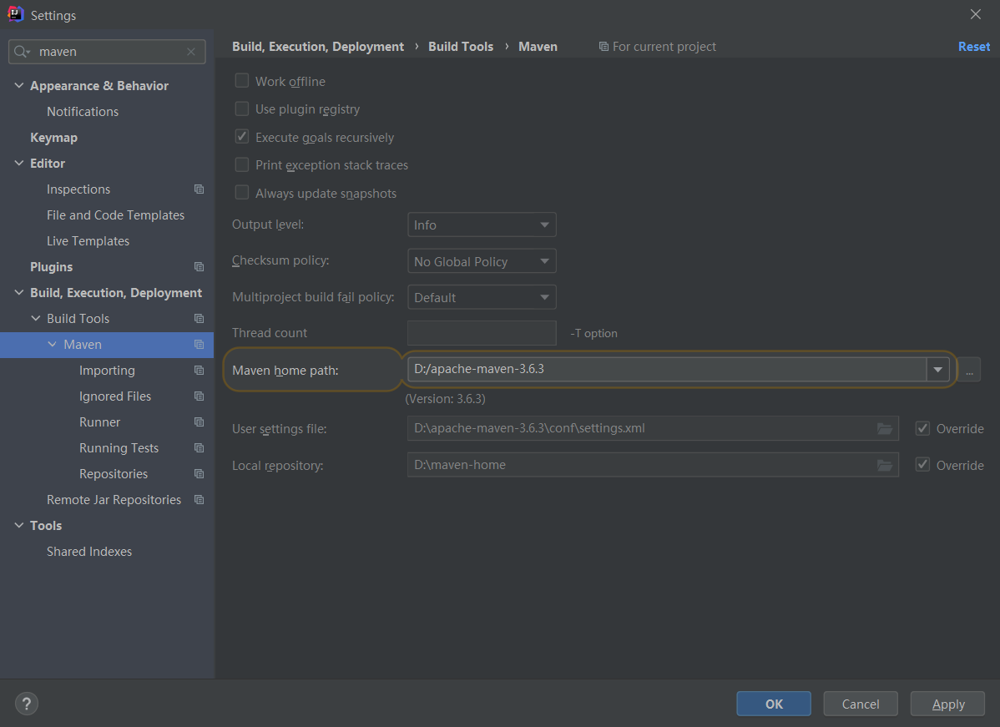

# 环境 - 开发工具 & 环境安装配置

> P12 P13 合到一块

+ jdk1.8+
+ maven 3.6.0+

maven 使用阿里云镜像

可参考 阿里的 [Maven 公共代理库](https://developer.aliyun.com/article/754038)

```xml
<mirror>
      <id>aliyunmaven</id>
      <mirrorOf>*</mirrorOf>
      <name>阿里云公共仓库</name>
      <url>https://maven.aliyun.com/repository/public</url>
</mirror>
```

idea 使用自己下载的 maven 及环境配置



idea 安装 Lombok 和 MybatisX 插件

安装 vscode，然后安装一些前端开发插件

安装 git 进行版本控制,打开 git bash，进行如下配置

git 配置全局用户名和邮箱

```shell
git config --global user.name "username"
git config --global user.email "username@email.com"
```

git 配置密钥

```shell
ssh-keygen -t rsa -C "username@email.com"
```

将生成的密钥配置到 gitee 或 github

查看生成的密钥

```shell
cat ~/.ssh/id_rsa.pub
```

测试密钥是否配置成功

```shell
ssh -T git@gitee.com
```

