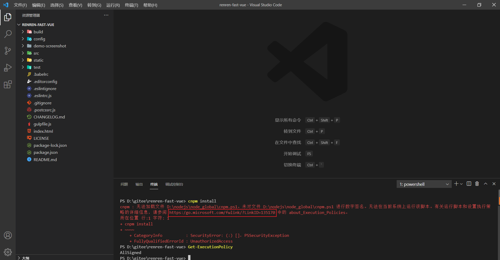

# 快速开发 - 人人开源搭建后台管理系统

## renren-fast 克隆运行

前往 gitee 克隆 [renren-fast](https://gitee.com/renrenio/renren-fast) 和 [renren-fast-vue](https://gitee.com/renrenio/renren-fast-vue) 到本地

+ renren-fast 后端
+ renren-fast-vue 前端

1. renren-fast 中的 pom.xml 去除 docker-maven-plugin 和 wagon-maven-plugin 插件
后面新加的插件如果无法下载则删除爆红插件
2. renren-fast 引用的 springboot 版本根据实际情况更新
3. pom.xml 引入 validation-api 依赖

## 安装 node.js

请前往 [node.js 官网下载页](http://nodejs.cn/download/) 进行下载

安装后使用 `node -v` 命令查看版本

**更改 npm 全局 module 安装和缓存目录**

```shell
npm config set cache "D:\soft\soft_work\node\node_cache"
npm config set prefix "D:\soft\soft_work\node\node_global"
```

**设置 npm 使用淘宝镜像**

```shell
npm config set registry https://registry.npm.taobao.org/
```

使用 `npm config get registry` 命令查看镜像仓库源是否已更改

## 下载组件依赖

前端项目第一次运行需要运行 `npm install` 命令下载依赖组件，powershell 控制台无法执行脚本，需要更改策略



通过 `Get-ExecutionPolicy` 命令查看有效的执行策略，可以看到是 AllSigned 策略

由于安装的脚本没有签名，所以我们需要将策略设为不限制（Unrestricted）,并且只为当前用户设置，当前用户优先级高于本机策略，执行以下命令即可

```shell
Set-ExecutionPolicy -ExecutionPolicy Unrestricted -Scope CurrentUser
```


由于要依赖 Python2 ，此项目不再更新。